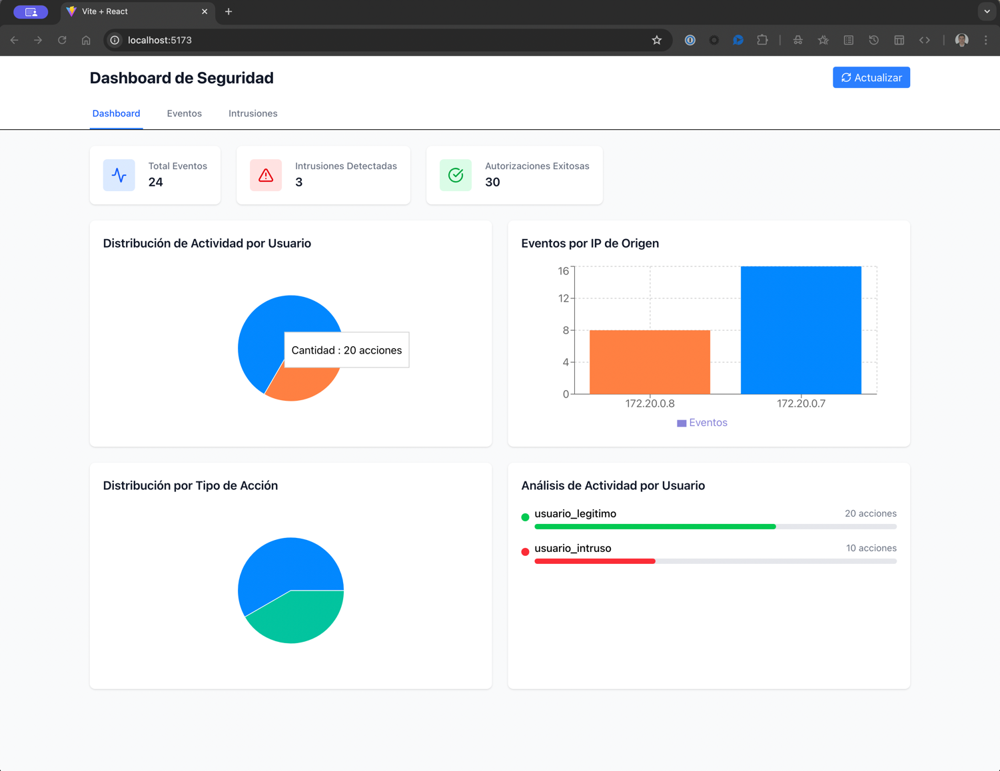
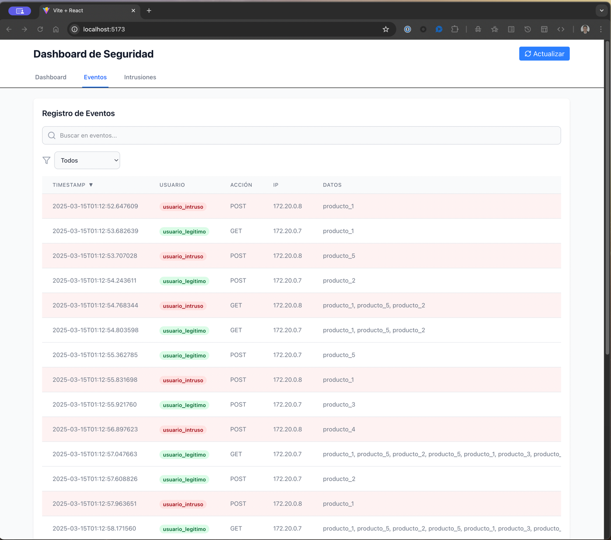
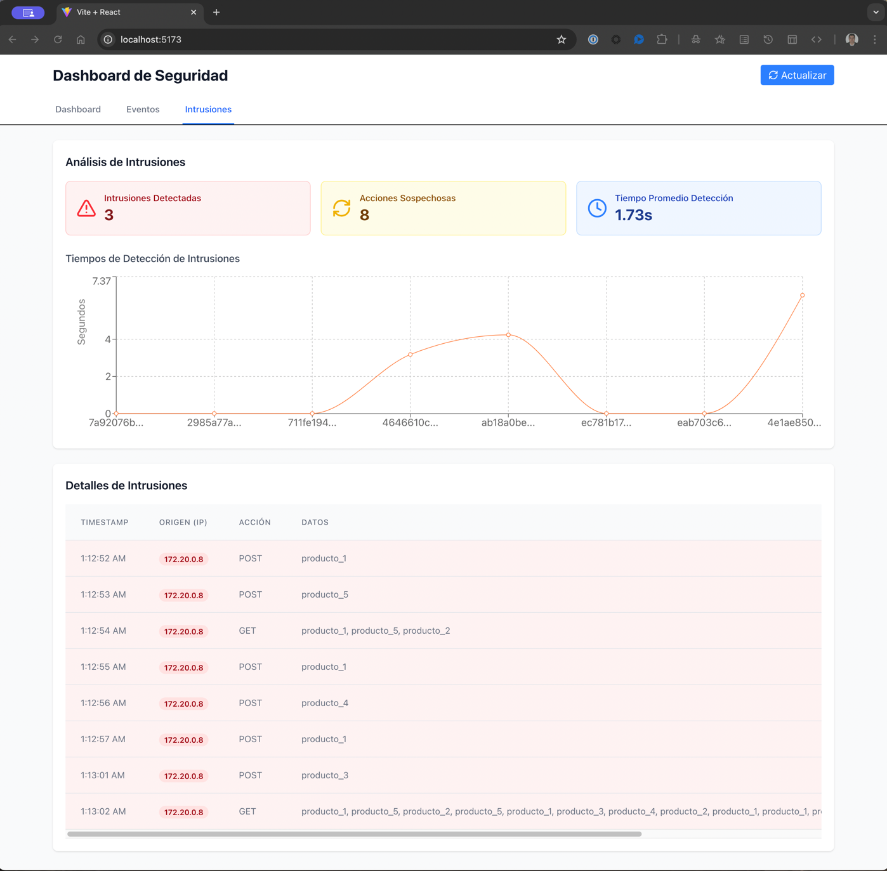

| **Titulo del experimento**                 | Detector de Intrusos                                                                                                                                                                                                                                                                                                                                                                                                                                                                                                                                                                                                                                                                   |
|--------------------------------------------|----------------------------------------------------------------------------------------------------------------------------------------------------------------------------------------------------------------------------------------------------------------------------------------------------------------------------------------------------------------------------------------------------------------------------------------------------------------------------------------------------------------------------------------------------------------------------------------------------------------------------------------------------------------------------------------|
| **Propósito del experimento**              | Intentar detectar intrusos dentro del sistema, que hayan logrado superar la medida de restricción de autorización y reportar esta detección.                                                                                                                                                                                                                                                                                                                                                                                                                                                                                                                                           |
| **Resultados esperados**                   | Lograr detectar intrusos en menos de 2 segundos. <br> Detectar y reportar el 100% operaciones no permitidas realizadas por intrusos.                                                                                                                                                                                                                                                                                                                                                                                                                                                                                                                                                   |
| **Recursos requeridos**                    | Docker/DockerCompose, Message broker - RabbitMQ                                                                                                                                                                                                                                                                                                                                                                                                                                                                                                                                                                                                                                        |
| **Elementos de arquitectura involucrados** | **Identificador del ASR** <br> Seguridad: Se debe detectar y reportar el 100% de las operaciones no permitidas realizadas por intrusos. <br><br> **Elementos de arquitectura:** <br> Componente Microservicio Comando Inventario <br> Componente Broker de Mensajes <br> Componente Auditor de inventario <br> Componente Autorizador <br> Componente Detector de intrusos <br><br>  Vista Funcional - Modelo Componente Conector <br> <br> **Puntos de sensibilidad**: <br> Utilizar una lista blanca de IPs para determinar la legitimidad de la procedencia de los mensajes publicados en la cola de mensajes <br> Utilizar comunicación sincrónica para el reporte de intrusiones. |
| **Esfuerzo estimado**                      | 32 horas totales                                                                                                                                                                                                                                                                                                                                                                                                                                                                                                                                                                                                                                                                       | (8 horas hombre) x 4 personas |

# Instrucciones para correr el experimento
Se configuró un archivo `docker-compose.yml` de tal manera que todo este sincronizado y para correr el experimento solo se requiere ejecutar el siguiente comando:

```bash
docker compose up -d --build
```

# Verificar resultados del experimento
Luego de correr el experimento se espera que se generen 4 archivos de log por cada componente del experimento, se deberá ver algo así:

````
❯ ls -l logs
total 32
-rw-r--r--  1 angel.henao  staff  1944 Mar 14 19:59 auditor.log
-rw-r--r--  1 angel.henao  staff  2832 Mar 14 19:59 autorizador.log
-rw-r--r--  1 angel.henao  staff  2279 Mar 14 19:59 detector_intrusos.log
-rw-r--r--@ 1 angel.henao  staff  3743 Mar 14 19:59 inventario.log
````

Adicionalmente el contenedor de dashboard se crea y queda corriendo

```
❯ docker ps | grep dashboard
637cca6773cd   arquitecturas_agiles-dashboard     "docker-entrypoint.s…"   44 seconds ago       Up 18 seconds             0.0.0.0:5173->5173/tcp                                                                                        security_dashboard
```


# Análisis de los resultados
Se genera un dashbaord automático el cual es accesible en la URL `http://localhost:5173`





